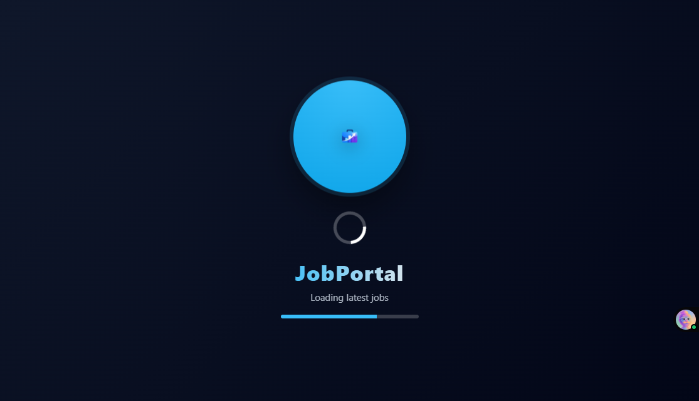
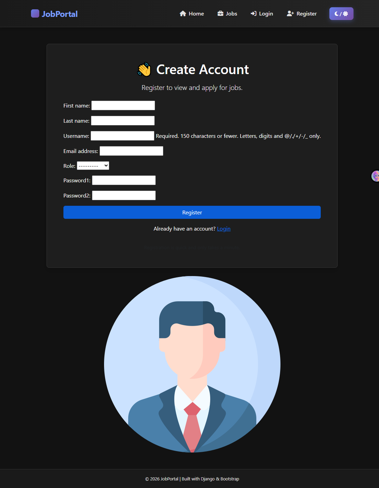
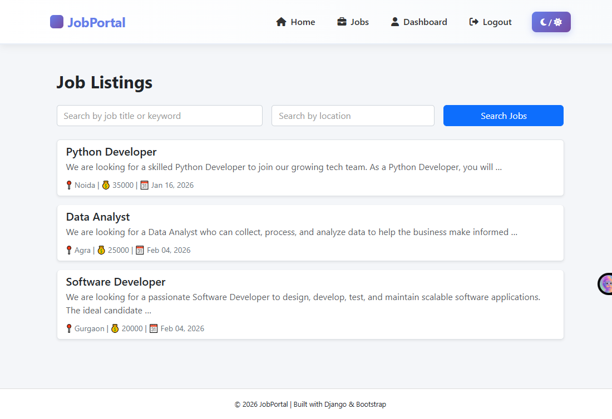
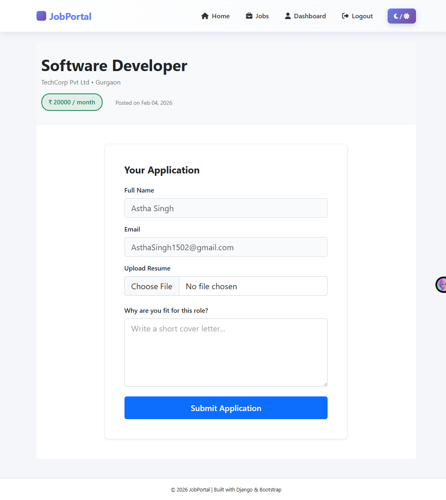
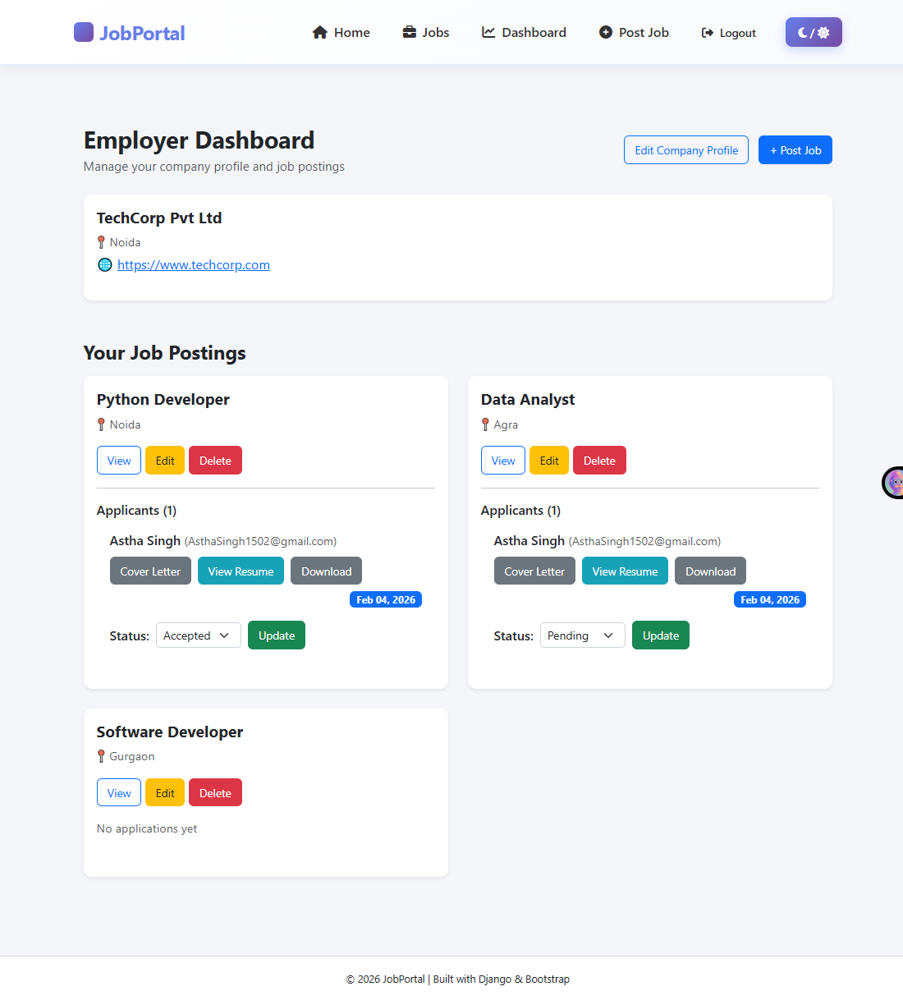
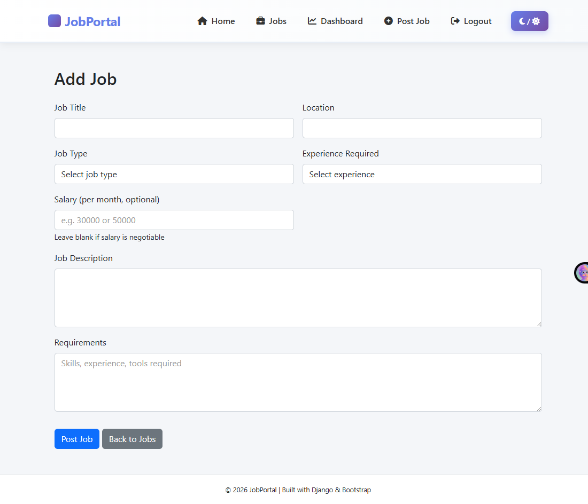

# 🚀 Job Portal Application

A **Django-based Job Portal web application** that allows employers to post jobs and candidates to apply for them.  
This project is built as part of learning Django and implementing real-world job portal features.

---

## ✨ Features

- User authentication (Employer & Candidate)
- Employer profile management
- Job posting and job listing
- Candidate job application
- Admin panel for managing data
- Responsive UI using HTML & CSS

---

## 🛠 Tech Stack

- **Backend:** Python, Django  
- **Frontend:** HTML, CSS, Bootstrap  
- **Database:** SQLite (Development)  
- **Tools:** Git, GitHub, VS Code  

---

## 📂 Project Structure

FIRSTDJANGO_PROJECT/
│
├── Job_Portal/        # Project settings
├── accounts/          # User accounts app
├── jobs/              # Jobs app
├── templates/         # HTML templates
├── static/            # CSS & static files
├── media/             # Uploaded files (ignored in Git)
├── screenshots/       # Project screenshots
├── manage.py
└── requirements.txt

```

## ⚙️ Installation & Setup

1. Clone the repository
```bash
git clone https://github.com/srashtisikarwar/Job-Portal-Django.git
Navigate to the project folder

cd Job-Portal-Django
Create & activate virtual environment

python -m venv myenv
myenv\Scripts\activate
Install dependencies

pip install -r requirements.txt
Run migrations

python manage.py migrate
Start the server

python manage.py runserver
---

👩‍💻 Author
Srashti Sikarwar
Django Developer (Fresher)

GitHub:[Job-Portal-Django](https://github.com/srashtisikarwar/Job-Portal-Django.git)

⭐ Future Improvements
Role-based dashboard

Resume upload

---

## 🖼️ Screenshots/dark_theme


## 🌙 Dark Theme (User Flow)

### 1️⃣ Loading / Splash Screen
[](screenshots/dark_theme/loading.png)

### 2️⃣ Home Page
[](screenshots/dark_theme/home.png)

### 3️⃣ Login Page
[](screenshots/dark_theme/login.png)

### 4️⃣ Register Page
[](screenshots/dark_theme/register.png)

### 5️⃣ Job Listings
[](screenshots/dark_theme/jobs.png)

### 6️⃣ Apply Job
[](screenshots/dark_theme/jobs_apply.png)

### 7️⃣ Job Details
[](screenshots/dark_theme/job_details.png)

### 8️⃣ Candidate Dashboard
[](screenshots/dark_theme/candidate_dashboard.png)

### 9️⃣ Employer Dashboard
[](screenshots/dark_theme/employer_dashboard.png)

### 🔟 Post Job (Admin/Employer)
[](screenshots/dark_theme/post_job.png)

### 11️⃣ Admin Dashboard
[](screenshots/dark_theme/admin.png)


## ☀️ Light Theme (User Flow)

### 1️⃣ Home Page
[](screenshots/light_theme/home.png)

### 2️⃣ Login Page
[](screenshots/light_theme/login.png)
o
### 3️⃣ Register Page
[](screenshots/light_theme/register.png)

### 4️⃣ Job Listings
[](screenshots/light_theme/jobs.png)

### 5️⃣ Apply Job
[](screenshots/light_theme/jobs_apply.png)

### 6️⃣ Job Details
[](screenshots/light_theme/job_details.png)

### 7️⃣ Candidate Dashboard
[](screenshots/light_theme/candidate_dashboard.png)

### 8️⃣ Employer Dashboard
[](screenshots/light_theme/employer_dashboard.png)

### 9️⃣ Post Job
[](screenshots/light_theme/post_jobs.png)

### 🔟 Admin Dashboard
[](screenshots/light_theme/admin.png)
