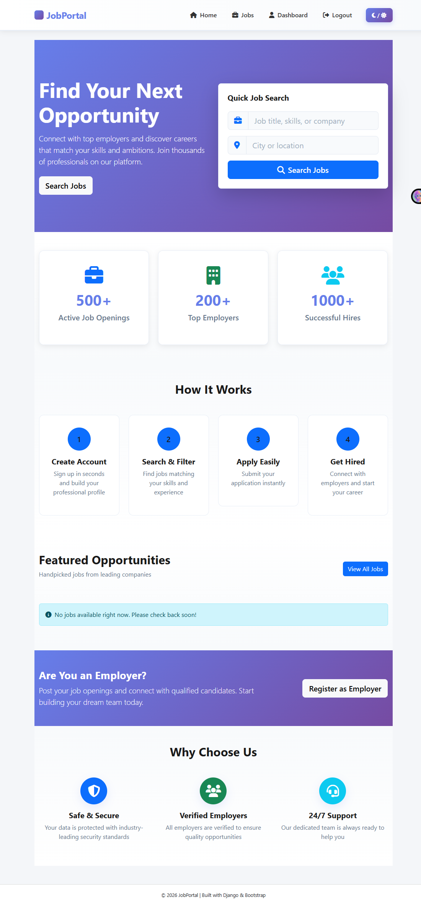

# Job Portal Application

A Django-based Job Portal web application that allows employers to post jobs and candidates to apply for them.  
This project is built as part of learning Django and implementing real-world features.

---

## 🚀 Features

- User authentication (Employer & Candidate)
- Employer profile management
- Job posting and job listing
- Candidate job application
- Admin panel for managing data
- Responsive UI using HTML, CSS, Bootstrap

---

## 🛠 Tech Stack

- **Backend:** Python, Django  
- **Frontend:** HTML, CSS, Bootstrap  
- **Database:** SQLite (Development)  
- **Tools:** Git, GitHub, VS Code  

---

## 📂 Project Structure

Job_Portal/ # Django project folder
accounts/ # User accounts app
jobs/ # Jobs app
templates/ # HTML templates
static/ # CSS & static files
media/ # Uploaded files (ignored in Git)
manage.py
requirements.txt
screenshots/ # Screenshots folder

---

## ⚙️ Installation & Setup

1. **Clone the repository**
```bash
git clone https://github.com/srashtisikarwar/Job-Portal-Django.git
Navigate to the project folder

cd Job_Portal
Create & activate virtual environment

python -m venv myenv
# Windows
myenv\Scripts\activate
# Mac/Linux
source myenv/bin/activate
Install dependencies

pip install -r requirements.txt
Run migrations

python manage.py migrate
Start the server

python manage.py runserver
Open in browser
http://127.0.0.1:8000/

👩‍💻 Author
Srashti Sikarwar
Django Developer (Fresher)

GitHub: https://github.com/srashtisikarwar/Job-Portal-Django.git

⭐ Future Improvements
Role-based dashboards

Resume upload functionality

## 🖼️ Screenshots – Light Theme (Thumbnails)

<<<<<<< HEAD
**Home Page**  

=======
| Home Page | Login Page | Register Page |
|-----------|------------|---------------|
|  |  |  |
>>>>>>> 555a419 (Add thumbnail gallery version for screenshots)

| Job Listings | Job Details | Apply Job |
|--------------|------------|-----------|
|  |  |  |

| Candidate Dashboard | Employer Dashboard | Post Job |
|-------------------|-----------------|---------|
|  |  |  |

| Admin Dashboard |  |  |
|----------------|--|--|
|  |  |  |

---

## 🖼️ Screenshots – Dark Theme (Thumbnails)

| Home Page | Login Page | Register Page |
|-----------|------------|---------------|
|  |  |  |

| Job Listings | Job Details | Apply Job |
|--------------|------------|-----------|
|  |  |  |

| Candidate Dashboard | Employer Dashboard | Post Job |
|-------------------|-----------------|---------|
|  |  |  |

| Loading Screen |  |  |
|----------------|--|--|
|  |  |  |
